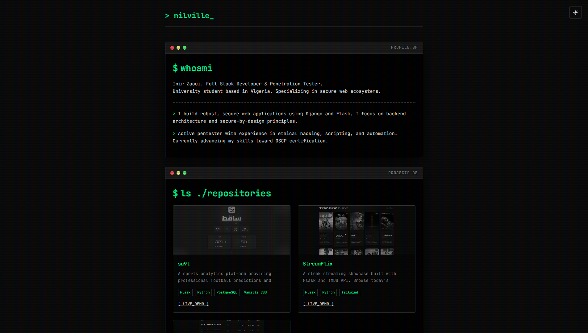

# 🖥️ nilville | Terminal Portfolio

A sleek, terminal-inspired personal portfolio showcasing the intersection of web development and cybersecurity. Built with a focus on performance, security, and a "hacker" aesthetic.

## 🚀 Overview

This project serves as my digital identity, highlighting my journey as a **Full Stack Developer** and **Penetration Tester**. The UI is designed to mimic a terminal environment, complete with scanlines, monospace typography, and command-line metaphors.

### 🛠️ Core Features
- **Dynamic Theme Engine:** Seamlessly switch between `Dark (System)` and `Light` modes with persistent local storage.
- **Retro CRT Aesthetic:** Custom scanline overlays and flickering cursor effects for an immersive experience.
- **Responsive Terminal Windows:** Modular UI components that adapt to any screen size.
- **Interactive Terminal Feedback:** Simulated transmission logs and status messages on form submission.
- **Secure-by-Design:** Clean, optimized codebase focusing on modern web standards.

## 🧰 Tech Stack

| Category | Technologies |
| :--- | :--- |
| **Frontend** | HTML5, Vanilla CSS (Custom Properties), Vanilla JavaScript |
| **Backend (Projects)** | Python, Flask, Django, PostgreSQL |
| **Design** | JetBrains Mono, Font Awesome, CRT-style animations |
| **Security** | Kali Linux, Bash Scripting, Automation |

## 📂 Project Showcase

My portfolio highlights several key repositories:

- **sa9t:** A sports analytics platform using Flask and PostgreSQL for real-time football predictions.
- **StreamFlix:** A modern movie/TV showcase powered by the TMDB API and Tailwind CSS.
- **PolyPulse:** A high-performance Polymarket scanner utilizing parallel API fetching.

## 📬 Connectivity

Find me across the digital landscape:

- **X (Twitter):** [@mlsc87](https://x.com/mlsc87)
- **LinkedIn:** [Inir Zaoui](https://www.linkedin.com/in/inir-zaoui-419216318/)

---
*Built with 💚 and `0.1s` ping by Inir Zaoui.*
